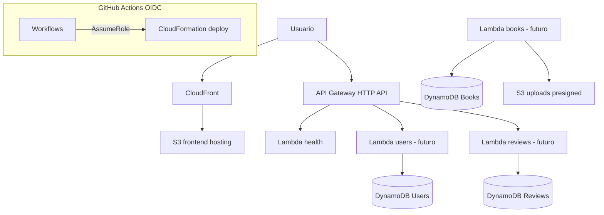
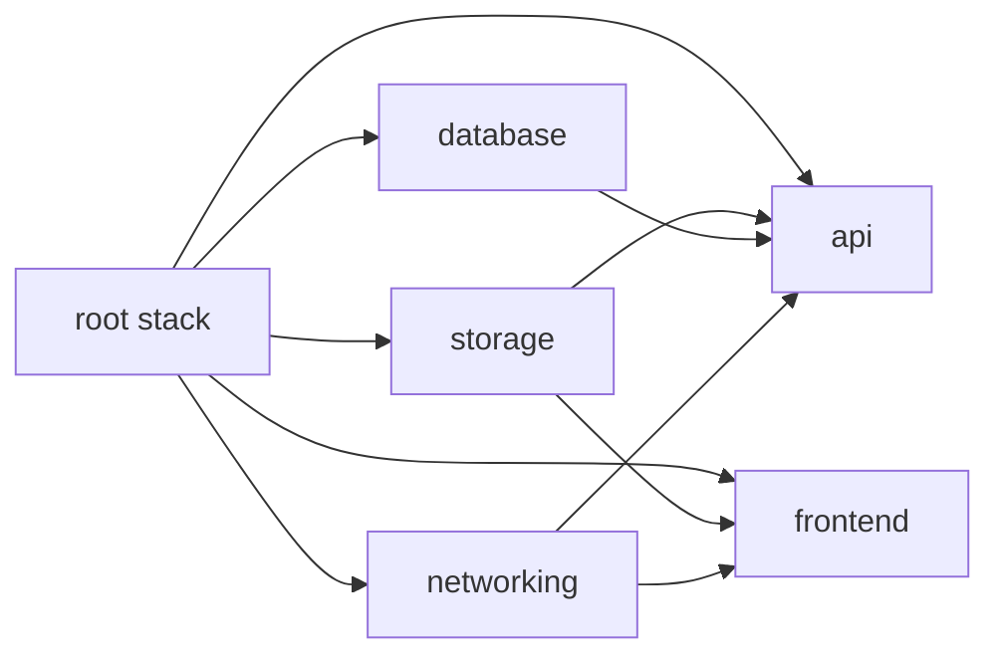
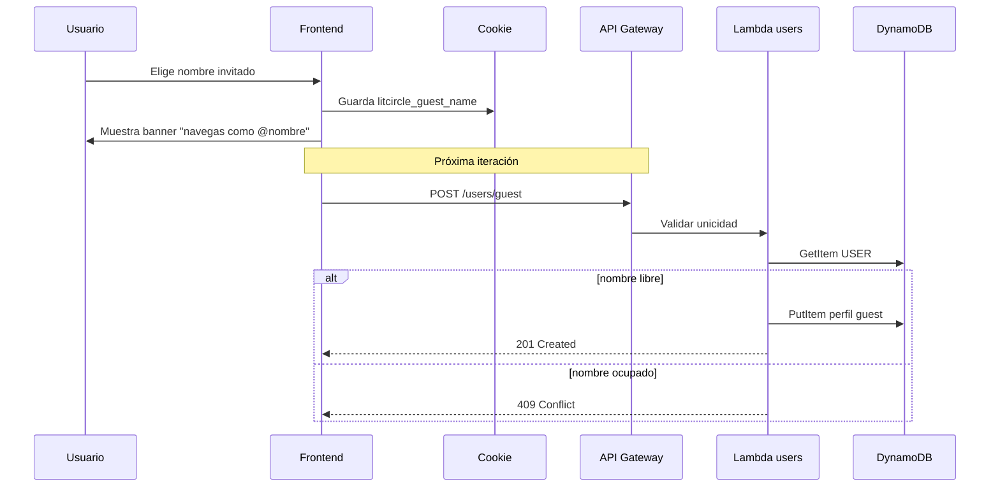
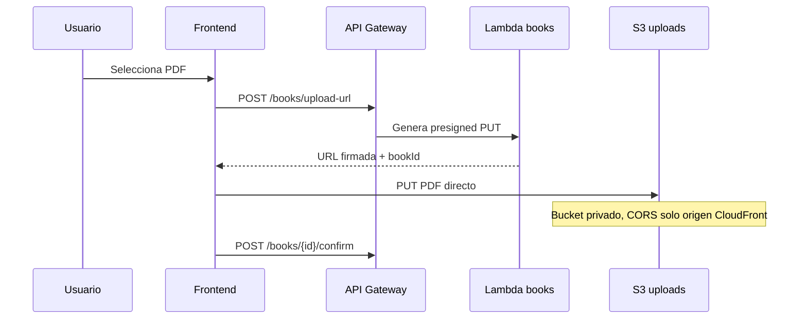

# Architecture — LitCircle (ChapterQuest)

## Visión general

LitCircle es una plataforma serverless en AWS. El frontend se sirve desde CloudFront + S3; la API expone HTTP API Gateway que invoca Lambdas; los datos viven en DynamoDB y S3.



## Capas del monorepo

| Directorio | Responsabilidad |
|------------|-----------------|
| `frontend/` | SPA React — UI LitCircle |
| `functions/` | Handlers Lambda + servidor local Express |
| `infrastructure/` | CloudFormation modular por capa |
| `scripts/` | Build esbuild, deploy stacks |
| `.github/workflows/` | CI/CD única fuente de deploy |

## Infraestructura (nested stacks)

El stack raíz `chapterquest-root-{env}` orquesta:



| Stack | Recursos |
|-------|----------|
| `networking` | ACM certs, Route53 (condicional) |
| `storage` | S3 frontend + uploads |
| `database` | DynamoDB Users, Books, Reviews, Comments |
| `api` | HTTP API + Lambdas + roles IAM |
| `frontend` | CloudFront OAC + bucket policy |

Parámetro `EnableCustomDomain` (default `false`): cuando compres `litcircle.com`, activa dominios custom sin reescribir templates.

## DynamoDB — diseño de claves

Diseño single-table style por entidad, expandible con GSIs.

### Users

| Atributo | Valor |
|----------|-------|
| PK | `USER#<username>` |
| SK | `PROFILE` |

Unicidad de invitado: `GetItem` por PK antes de crear. Atributos: `type=guest`, `createdAt`, `lastSeenAt`.

### Books

| Atributo | Valor |
|----------|-------|
| PK | `BOOK#<bookId>` |
| SK | `METADATA` |
| GSI1PK | `USER#<ownerId>` |
| GSI1SK | `BOOK#<bookId>` |

### Reviews

| Atributo | Valor |
|----------|-------|
| PK | `BOOK#<bookId>` |
| SK | `REVIEW#<reviewId>` |
| GSI1PK | `USER#<authorId>` |
| GSI1SK | `REVIEW#<reviewId>` |

### Comments

| Atributo | Valor |
|----------|-------|
| PK | `BOOK#<bookId>` |
| SK | `COMMENT#<timestamp>#<commentId>` |

Alternativa futura: PK `REVIEW#<reviewId>` para hilos por reseña.

## Flujo MVP: invitado



## Flujo MVP: upload PDF (presigned URLs)



**No** usar bucket policy con `Referer` — es falsificable. Presigned URLs + CORS + IAM least privilege.

## Backend — capas Lambda

```text
handler  →  service  →  repository  →  DynamoDB / S3
```

- **Handler**: adapta evento API Gateway, sin lógica de negocio.
- **Service**: reglas de dominio.
- **Repository**: acceso a datos.

## Seguridad

- IAM: rol de ejecución **por Lambda**.
- S3: Block Public Access; frontend solo vía CloudFront OAC.
- DynamoDB: encryption at rest, PITR habilitado.
- CI/CD: GitHub OIDC → IAM Role (sin access keys en secrets).
- HTTPS: CloudFront y API Gateway por defecto.

## Entornos

Recursos aislados por prefijo `{env}-`. Ramas `dev` y `main` despliegan a entornos independientes vía GitHub Actions.
