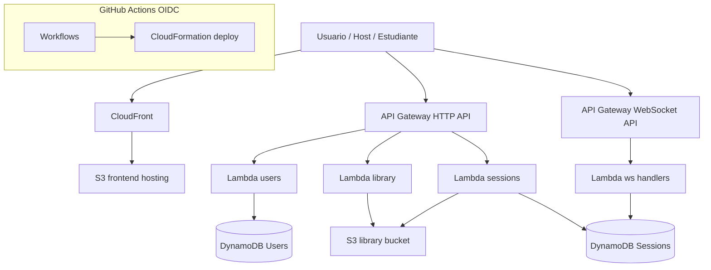
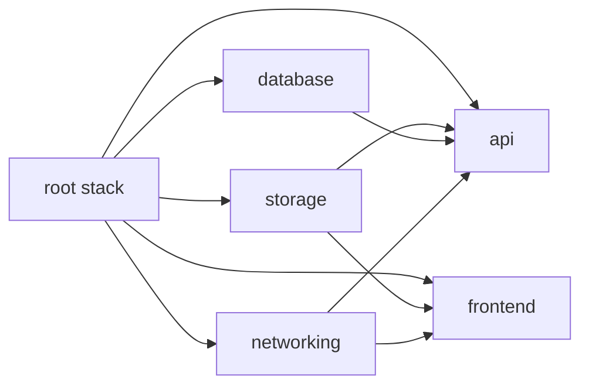
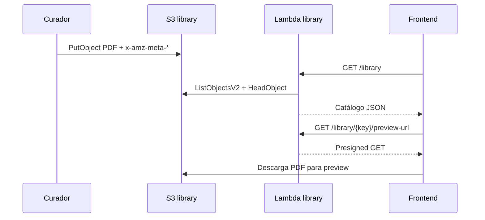
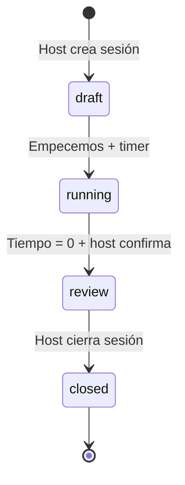
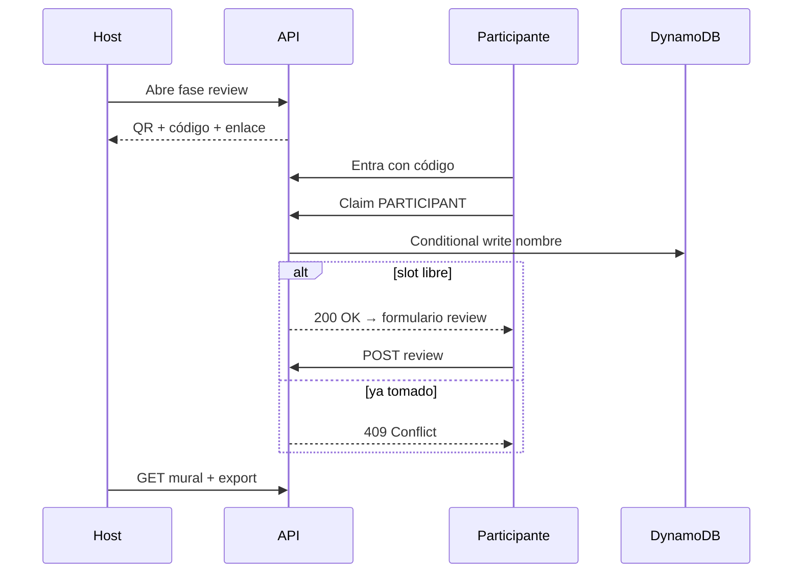
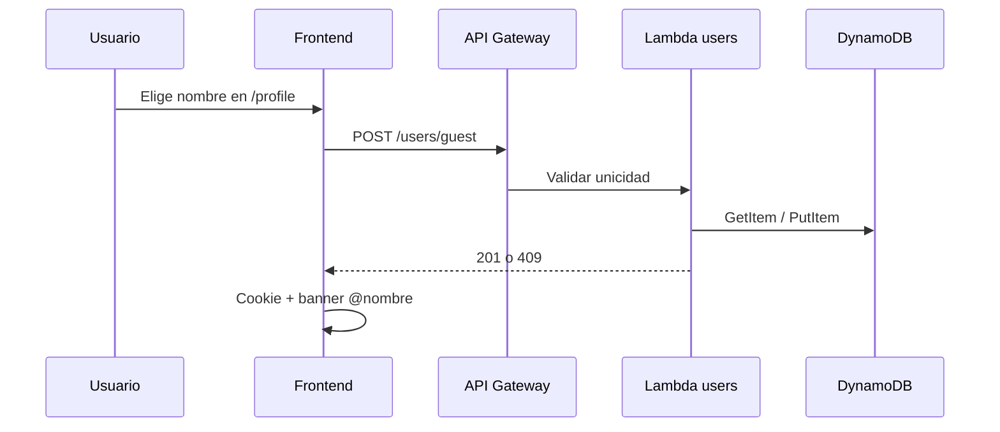

# Architecture — LitCircle (ChapterQuest)

Visión técnica de la plataforma. La definición funcional del producto está en **[ProductSpec.md](./ProductSpec.md)**.

---

## Visión general

LitCircle es una plataforma serverless en AWS orientada a **sesiones de círculo literario en escuelas**: biblioteca curada en S3, API REST para sesiones/reviews, y **WebSocket API** para sincronía en aula.



---

## Capas del monorepo

| Directorio | Responsabilidad |
|------------|-----------------|
| `frontend/` | SPA React — landing, biblioteca, guía, juguemos, review |
| `functions/` | Handlers Lambda + servidor local Express |
| `infrastructure/` | CloudFormation modular por capa |
| `scripts/` | Build, deploy stacks y frontend |
| `.github/workflows/` | CI/CD con detección de cambios por path |

---

## Infraestructura (nested stacks)



| Stack | Recursos |
|-------|----------|
| `networking` | ACM certs, Route53 (condicional) |
| `storage` | S3 frontend + **library** (`{env}-chapterquest-library`, prefijo `library/`) |
| `database` | DynamoDB **Users**, **Sessions** (single-table + GSI1 + TTL) |
| `api` | HTTP API + WebSocket API + Lambdas + roles IAM |
| `frontend` | CloudFront OAC + bucket policy |

---

## Biblioteca curada (S3)

**Decisión de producto:** no hay upload desde la UI. El curador sube PDFs al bucket `{env}-chapterquest-library` bajo el prefijo `library/`.



**Metadata recomendada:** `title`, `author`, `language`, `grade` (ver ProductSpec).

**Preview:** presigned URL + visor cliente (PDF.js / react-pdf — por decidir).

---

## Sesiones y role play



Persistencia propuesta en DynamoDB (`Sessions`): participantes, roles, libro, timer, estado, reviews.

Sincronía en tiempo real (timer, mural): **API Gateway WebSocket** + tabla de conexiones.

---

## Flujo de review



---

## DynamoDB — diseño actual y evolución

### Users (implementado)

| Atributo | Valor |
|----------|-------|
| PK | `USER#<username>` |
| SK | `PROFILE` |

Invitado: unicidad por username, cookie en frontend.

### Sessions (desplegado en IaC — lógica pendiente)

Tabla `{env}-chapterquest-sessions` con TTL en atributo `ttl` y **GSI1** para lookup por código de acceso.

| Atributo | Valor |
|----------|-------|
| PK | `SESSION#<sessionId>` |
| SK | `METADATA` \| `PARTICIPANT#<n>` \| `REVIEW#<n>` \| `CONNECTION#<id>` |
| GSI1PK | `CODE#<accessCode>` |
| GSI1SK | `SESSION#<sessionId>` |

Reviews y conexiones WebSocket viven en la misma tabla (single-table design).

---

## Flujo implementado: invitado



---

## Backend — capas Lambda

```text
handler  →  service  →  repository  →  DynamoDB / S3
```

Servicios previstos por dominio:

| Servicio | Rutas / triggers | Estado IaC |
|----------|------------------|------------|
| `auth` | `GET /health` | ✅ |
| `users` | `POST /users/guest` | ✅ |
| `library` | `GET /library`, `GET /library/{key}/preview-url` | ✅ stub |
| `sessions` | CRUD sesión, reviews, export, by-code | ✅ stub |
| `ws` | `$connect`, `$disconnect`, `$default` | ✅ stub |

---

## Frontend — mapa de rutas (objetivo)

| Ruta | Sección | Estado |
|------|---------|--------|
| `/` | Landing | Placeholder |
| `/library` | Biblioteca | Placeholder |
| `/guide` | Guía | Por crear |
| `/play` | Juguemos | Por crear |
| `/play/:sessionId/review` | Mural host | Por crear |
| `/review/:code` | Entrada participante | Por crear |
| `/profile` | Perfil invitado | Implementado |

Rutas legacy `/reviews`, `/community` se deprecarán o redirigirán en favor del flujo de sesión.

---

## Seguridad

- IAM: rol de ejecución **por Lambda**
- S3: Block Public Access; lectura PDF vía presigned URLs
- DynamoDB: encryption at rest, PITR
- CI/CD: GitHub OIDC (sin access keys de larga vida)
- Host token para cerrar sesión (MVP); auth docente completa — decisión abierta

---

## Entornos y build frontend

| Variable | Dev | Prod |
|----------|-----|------|
| `VITE_APP_ENV` | `dev` | `prod` |
| `VITE_API_BASE_URL` | ApiEndpoint stack dev | ApiEndpoint stack prod |

CI inyecta ambas en `deploy-frontend`. Chip MUI visible solo en `dev` y `local`.

---

## Referencias

- [ProductSpec.md](./ProductSpec.md) — SDD completo
- [Deployment.md](./Deployment.md)
- [functions/README.md](../functions/README.md)
