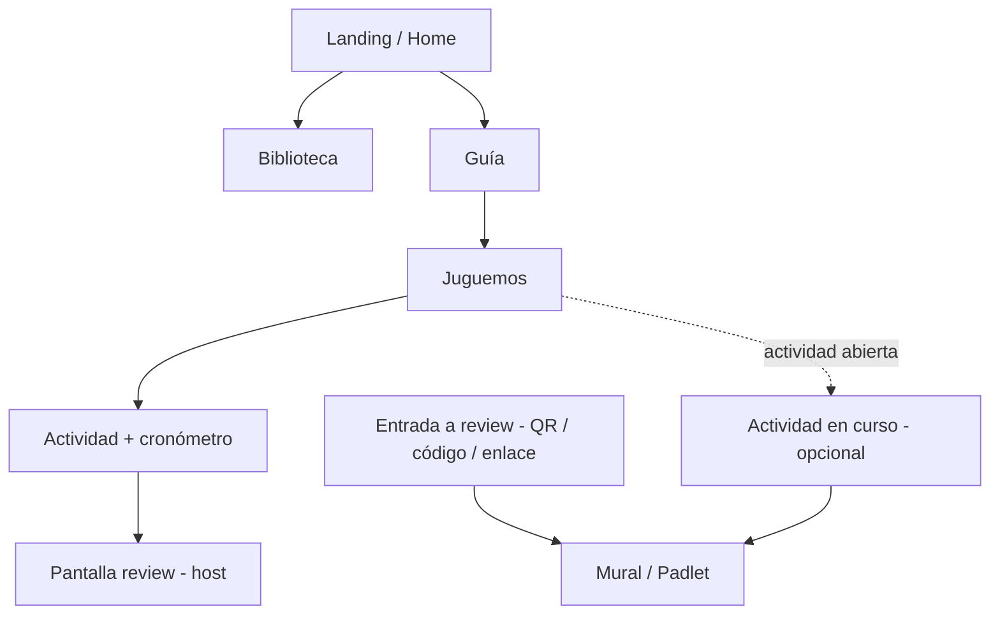
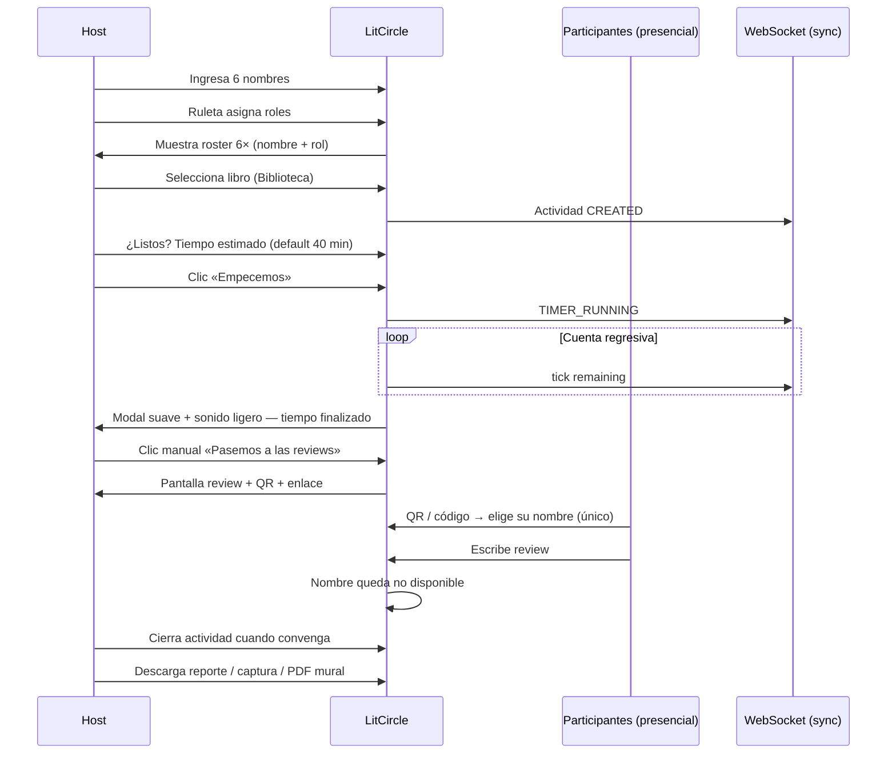
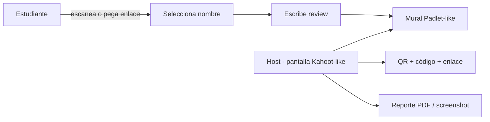
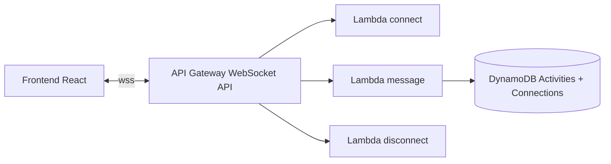

# LitCircle — Especificación de producto (SDD)

Documento de referencia para iteraciones futuras. **LitCircle** es el producto; **ChapterQuest** es el nombre técnico del repositorio y la plataforma serverless.

> Última revisión: reunión con cliente — junio 2026.

---

## 1. Resumen ejecutivo

LitCircle es una plataforma web para **círculos literarios escolares**: fortalecer hábitos de lectura, trabajo colaborativo e inglés mediante clubes de lectura interactivos con **role play** presencial, cronómetro facilitado y **reviews** asíncronas tipo mural (Padlet/Kahoot).

El flujo principal no es “subir PDFs como usuario”, sino **curaduría centralizada**: el equipo sube libros al bucket S3 y la biblioteca los lista automáticamente. La actividad en aula es **presencial**; el sistema apoya al docente/facilitador con temporizador, asignación de roles y recolección de reviews identificadas por participante.

---

## 2. Propuesta de valor

| Pilar | Descripción |
|-------|-------------|
| **Read** | Acceso a biblioteca curada de PDFs con preview |
| **Share** | Role play colaborativo con 6 roles definidos |
| **Learn Together** | Reviews post-actividad vinculadas a participantes (nombre + rol) de la actividad |

**Tagline:** *Read, Share, Learn Together*

**Contexto de uso:** escuelas, actividad presencial en aula, reviews posiblemente asíncronas (tarea).

---

## 2.1 Modelo de identidad — sin login ni sesión de usuario

**[Cierto] LitCircle no tiene inicio de sesión (login).** No existe cuenta de estudiante ni sesión autenticada que persista la identidad del usuario entre visitas.

| Concepto | ¿Persiste? | Descripción |
|----------|------------|-------------|
| **Actividad de role play** | ✅ Sí (DynamoDB) | Instancia del juego en aula: 6 nombres, roles asignados, libro, timer, reviews. API: recurso `/sessions` (= actividad, no login). |
| **Participante** | Solo dentro de la actividad | Nombre libre ingresado al inicio (1 de 6). **No** es una cuenta. |
| **Rol asignado** | Ligado al participante en esa actividad | Facilitator, Connector, etc. — asignado por ruleta. |
| **Perfil invitado** (implementación actual) | Cookie opcional | Nombre en `/profile` para navegar el sitio. **No** participa en Juguemos ni reemplaza a los 6 nombres de la actividad. Puede eliminarse o quedar solo para uso general del sitio. |

**Regla de producto:** lo que el docente y los estudiantes retoman es la **actividad en curso** (código / enlace / QR), no un “usuario logueado”.

### 2.2 Visibilidad nombre + rol (requisito UX)

El sistema debe **mostrar en todo momento** quién es cada estudiante y qué rol le tocó:

| Momento | Qué se muestra |
|---------|----------------|
| Tras la ruleta | Pantalla de confirmación: 6 filas **Nombre — Rol** antes de iniciar timer |
| Durante la actividad | Panel fijo (host + pantalla proyectada): roster visible todo el tiempo |
| Cronómetro activo | Roster sigue visible; no ocultar roles al mostrar el timer |
| Fase review | Mural/reviews etiquetadas con **nombre + rol** del autor |
| Export / reporte | PDF o captura incluye nombre, rol y review de cada participante |

Formato recomendado en UI: **`María · Facilitator`** (nombre + rol en inglés pedagógico, o bilingüe).

---

## 3. Personas

| Persona | Rol en el sistema | Necesidades |
|---------|-------------------|-------------|
| **Host / docente** | Crea y conduce la **actividad** de role play, controla timer, cierra actividad, exporta reporte | Flujo claro, roster nombre+rol siempre visible |
| **Participante (estudiante)** | Uno de 6 nombres en la actividad; hace review con QR/código | Sin login; se identifica solo dentro de esa actividad |
| **Curador / admin** | Sube PDFs al bucket con metadata | Sin CRUD en app; operación vía S3/CLI |

---

## 4. Mapa del sitio

### 4.1 Landing (Home)

**Estado:** placeholder en código; contenido definido parcialmente por cliente.

**Contenido acordado:**

- Palabras de bienvenida: *Welcome to LitCircles, a platform designed to strengthen reading habits, collaborative work, and English skills through interactive book clubs.*
- Sección *What is the literary circle?* con definición del círculo literario.
- Imagen animada de **Malu y Danna** (animación por definir).
- **Futuro probable:** modelo 3D (Three.js) en hero de landing.

**Copy de referencia (inglés, UI puede ser bilingüe):**

> *Literary Circles are collaborative reading groups where students discuss a text, share ideas, and learn together through assigned roles.*

### 4.2 Biblioteca

**Modelo curado — sin upload público.**

| Aspecto | Decisión |
|---------|----------|
| Origen de libros | Bucket S3 `{env}-chapterquest-library`, prefijo `library/` |
| Quién sube | Curador/admin (CLI, consola AWS, script interno) — **no** el usuario final |
| Metadatos | Preferencia: **metadata nativa de objeto S3** (`x-amz-meta-*`) para autor, título, etc. |
| CRUD en app | **No** — evitar mantener servicio duplicado si metadata basta |
| UI | Listado + preview del PDF |

**Metadata S3 (propuesta técnica):**

| Clave metadata | Ejemplo | Uso en UI |
|----------------|---------|-----------|
| `x-amz-meta-title` | *Charlotte's Web* | Título |
| `x-amz-meta-author` | *E.B. White* | Autor |
| `x-amz-meta-language` | `en` | Badge idioma |
| `x-amz-meta-audience` | `+12 años` | Público objetivo (badge) |
| `x-amz-meta-grade` | `5-6` | Nivel escolar (opcional) |
| `x-amz-meta-cover` | clave S3 p. ej. `library/covers/slug.png` | Portada (presigned en catálogo) |
| `x-amz-meta-description` | sinopsis corta | Resumen en UI |

**Subida manual (curador):** script [`scripts/upload_book.sh`](../scripts/upload_book.sh) — sube PDF + portada con metadata. No hay Lambda de upload ni CRUD en app.

**API:** `GET /library` → catálogo JSON. `GET /library/{key}/preview-url` → presigned GET del PDF.

**Visor en reading time:** flipbook dinámico (`pdfjs-dist` + `react-pageflip`) con animación de pasar página; respeta `prefers-reduced-motion` (scroll plano).

### 4.3 Guía

Página estática (con componentes interactivos embebidos) que explica:

1. Cómo funciona el juego de role play.
2. Los **6 roles** (ver §5).
3. Flujo resumido: nombres → ruleta → libro → tiempo → actividad → review.
4. Cierre con CTA: **«¿Todo listo? Empecemos»** → navega a **Juguemos**.

### 4.4 Juguemos

Sección principal de la **dinámica de role play**. Redirige o contiene el flujo interactivo completo.

### 4.5 Actividad en curso (opcional, condicional)

Visible cuando el frontend detecta una **actividad de role play abierta** (`activityId` + validación en backend — no es login ni cookie de usuario).

- Lleva al panel del host o del participante según contexto.
- Nombre UI por validar con cliente: «Actividad en curso», «Continuar role play», etc.
- **No** confundir con el perfil invitado de `/profile`.

### 4.6 Entrada a review (participantes)

Múltiples caminos — todos deben convivir sin confundir a quien no tiene review pendiente:

| Método | Comportamiento |
|--------|----------------|
| **QR** (pantalla host) | Escaneo → selección de nombre → formulario review |
| **Enlace copiable** | Estilo Kahoot — URL con código de **actividad** |
| **Botón global** | «Tengo que hacer un review» → ingreso de código → tablero |

El botón global debe ser **discreto** o contextual para no parecer obsoleto cuando no hay reviews activas.

---

## 5. Los seis roles

Cada rol tiene descripción pedagógica (inglés en material cliente; UI puede mostrar ES/EN).

| Rol | Nombre EN | Responsabilidad resumida |
|-----|-----------|---------------------------|
| Facilitador | **Facilitator** | Abre discusión, resumen, pasaje interesante, preguntas, mantiene foco |
| Director de discusión | **Discussion Director** | Prepara preguntas que inviten a hablar del texto |
| Investigador | **Investigator** | Información extra: autor, contexto, setting, hechos |
| Conector | **Connector** | Conexiones text-to-self, text-to-world, text-to-text |
| Ilustrador | **Illustrator** | Dibujo/visual de evento, personaje o idea central |
| Inspector de vocabulario | **Vocabulary Inspector** | Palabras clave, significados, expresiones descriptivas |

**Asignación:** ruleta asigna **aleatoriamente** cada nombre a un rol único. Tras asignar, la UI **debe** mostrar el roster completo nombre + rol antes de continuar (ver §2.2).

---

## 6. Flujo de actividad (role play)

> En API e infraestructura el recurso se llama `Session` / `/sessions` por brevedad técnica. En producto = **actividad de role play**, no sesión de usuario.

### 6.1 Reglas de negocio

| # | Regla |
|---|-------|
| R1 | Exactamente **6 participantes** por actividad (nombres libres, **sin cuenta ni login**) |
| R2 | Cada nombre → **un rol** vía ruleta; roster **nombre + rol** visible en UI (§2.2) |
| R3 | Un **libro** por actividad, elegido de biblioteca curada |
| R4 | Tiempo en **minutos**; default **40**; explicación clara al host |
| R5 | Cronómetro **cuenta atrás**; al llegar a 0: alerta **no invasiva** (modal + sonido suave) |
| R5b | Host puede **terminar antes** del tiempo con confirmación explícita (modal) |
| R6 | Transición a review **manual** — botón «Realicemos el review» |
| R7 | En review, cada participante elige **su nombre de la actividad** una sola vez |
| R8 | Reviews **asíncronas** permitidas — identidad = nombre + rol de esa actividad |
| R9 | Host **cierra la actividad** explícitamente para poder iniciar otra |
| R10 | Host puede **exportar** reporte (PDF o imagen del mural) |

### 6.2 Identificación de participantes (sin login)

No hay registro ni inicio de sesión. Para la actividad y las reviews:

- Los 6 nombres se definen al **inicio de la actividad** (host).
- Cada nombre recibe un **rol** visible para todos (§2.2).
- En review, el participante **se autoselecciona** entre esos 6 nombres.
- Tras elegir, el nombre queda **bloqueado** para otros.

**Objetivo:** saber quién (nombre + rol) escribió qué en cada actividad real, aunque la review sea tarea para casa.

---

## 7. Flujo de review (mural)

**UI host:** código grande, QR, botón copiar enlace.

**UI participante:** selector de nombre (solo los 6 de la actividad) → muestra su rol asignado → textarea/tarjeta → envío al mural con etiqueta **nombre · rol**.

**Sincronización:** cuando un participante publica, el mural del host se actualiza (WebSocket o polling; ver §9).

---

## 8. Requisitos no funcionales

| ID | Requisito | Notas |
|----|-----------|-------|
| NFR-1 | **WebSockets** para experiencia síncrona | Timer, ruleta, mural visible en tiempo real para quienes estén conectados |
| NFR-2 | **Detección de actividad abierta** | `activityId` en storage + API → muestra «Actividad en curso» (no login) |
| NFR-3 | Alertas **no invasivas** | Timer fin: modal + sonido opcional; no interrumpir abruptamente |
| NFR-4 | Serverless first | API Gateway HTTP + WebSocket API; Lambda; DynamoDB; S3 |
| NFR-5 | Escuelas / tablets | UI responsive; QR legible en proyector |
| NFR-6 | Entornos **dev/prod** | Chip «Test environment» en dev (implementado) |
| NFR-7 | **Roster nombre + rol siempre visible** | Durante actividad, review y export (§2.2) |

### 8.1 WebSockets — dirección técnica (borrador)

Eventos previstos: `session.updated`, `timer.tick`, `role.assigned`, `review.posted`, `participant.claimed`.

---

## 9. Modelo de datos (evolución)

### 9.1 Implementado hoy

| Entidad | Almacén | Uso actual |
|---------|---------|------------|
| Perfil invitado (opcional) | DynamoDB `Users` + cookie | Navegación general del sitio. **No** es login ni identidad en Juguemos. |

### 9.2 Planificado — persiste la actividad, no el usuario

| Entidad | Almacén | Propósito |
|---------|---------|-----------|
| **Book (catálogo)** | S3 `{env}-chapterquest-library` + metadata | Fuente de verdad; sin tabla Books |
| **Actividad (role play)** | DynamoDB `sessions` | 6 participantes, roles, libro, timer, estado. API: `/sessions`. |
| **Review de actividad** | DynamoDB (misma tabla) | Texto + participantSlot + rol |
| **Conexión WebSocket** | DynamoDB (misma tabla) | Sincronía en aula |

**Tabla `sessions` (= actividades, no usuarios):**

| Atributo | Descripción |
|----------|-------------|
| PK | `SESSION#<activityId>` |
| SK | `METADATA` \| `PARTICIPANT#<1-6>` \| `REVIEW#<slot>` |
| status | `draft` \| `running` \| `review` \| `closed` |
| bookKey | Clave S3 del PDF |
| timerMinutes | Entero |
| timerEndsAt | ISO timestamp |
| hostToken | Token del docente para cerrar/exportar (no login de estudiantes) |

**Participante (`PARTICIPANT#n`):** `displayName`, `role` (ej. `Facilitator`), `claimedAt` (en review).

---

## 10. Estado de implementación

| Área | Estado | Notas |
|------|--------|-------|
| Infra AWS (dev/prod) | ✅ Desplegado | CloudFormation, CI/CD, OIDC |
| Guest / perfil opcional | ✅ Parcial | Cookie en `/profile` — **no** es login ni identidad en Juguemos |
| Landing contenido cliente | 🔲 Pendiente | Copy definido; animación TBD |
| Biblioteca S3 curada | ✅ Parcial | `GET /library`, script upload, flipbook reader |
| Guía (6 roles) | ✅ Mock UI | Página + copy |
| Juguemos (ruleta, timer) | ✅ Mock UI | Ruleta secuencial, terminar antes, reader PDF |
| WebSockets | 🔲 Pendiente | NFR sincronía |
| Review QR / mural | 🔲 Pendiente | Flujo Kahoot/Padlet |
| Export reporte | 🔲 Pendiente | PDF o imagen |
| Three.js landing | 🔲 Futuro | Probable iteración posterior |

**Rutas actuales en código (legacy):** `/`, `/library`, `/reviews`, `/community`, `/profile` — se reorganizarán según este documento en iteraciones de frontend.

---

## 11. Roadmap sugerido por iteraciones

| Iteración | Entregable | Dependencias |
|-----------|------------|--------------|
| **I1** ✅ | Fundación: monorepo, IaC, CI/CD, guest API | — |
| **I2** | Landing (copy cliente) + chip entorno + nav nueva | I1 |
| **I3** | Biblioteca: list S3 + metadata + preview PDF | Bucket `library/` + convención metadata |
| **I4** | Guía estática + CTA «Empecemos» | I3 (enlace a libros) |
| **I5** | Juguemos: nombres, ruleta, libro, timer local | I3 |
| **I6** | API actividades + persistencia DynamoDB | I5 |
| **I7** | WebSocket sync (timer + mural + roster) | I6, NFR-1 |
| **I8** | Review: QR, código, claim nombre, mural | I6 |
| **I9** | Host: cerrar actividad, export PDF/screenshot | I8 |
| **I10** | Landing Three.js / animación Malu y Danna | Diseño cliente |

---

## 12. Decisiones abiertas

| # | Tema | Opciones | Recomendación inicial |
|---|------|----------|------------------------|
| D1 | Visor PDF | PDF.js + react-pageflip (flipbook) | **Implementado** — presigned URL + flipbook en reading time |
| D2 | Metadata vs JSON sidecar | Solo S3 metadata vs `{book}.pdf` + `{book}.json` | Metadata si ≤6 campos; JSON si hay sinopsis larga |
| D3 | Prefijo S3 biblioteca | `library/`, `books/en/` | `library/` plano al inicio |
| D4 | Nombre sección actividad abierta | «Actividad en curso», «Continuar role play» | Validar con cliente |
| D5 | Idioma UI | EN pedagógico / ES navegación | Bilingüe progresivo |
| D6 | Sonido timer | Web Audio API, archivo MP3 suave | MP3 corto, volumen bajo, respetar `prefers-reduced-motion` |
| D7 | Control del docente | Solo host token vs login futuro | Host token en URL/storage para MVP — **sin login estudiantil** |

---

## 13. Glosario

| Término | Definición |
|---------|------------|
| **Actividad (role play)** | Instancia del juego en aula (6 nombres, roles, libro, timer). Persiste en DynamoDB. API: `/sessions`. **No** es login. |
| **Participante** | Estudiante identificado por nombre libre dentro de una actividad |
| **Rol** | Facilitator, Connector, etc. — asignado por ruleta a un participante |
| **Roster** | Lista visible de los 6 pares **nombre · rol** |
| **Host** | Docente que crea y cierra la actividad |
| **Perfil invitado** | Cookie opcional en `/profile` para navegar el sitio — **independiente** de Juguemos |
| **Círculo literario** | Grupo colaborativo que discute un texto con roles asignados |
| **Review** | Reflexión escrita post-actividad, firmada con nombre + rol |
| **Curador** | Persona que sube PDFs al bucket (fuera de la app) |

---

## 14. Referencias

- [Features.md](./Features.md) — backlog por feature (checklist + enlace a este SDD)
- [Architecture.md](./Architecture.md) — diagramas técnicos y AWS
- [Deployment.md](./Deployment.md) — deploy y entornos
- [Startup.md](./Startup.md) — bootstrap desde cero
- [README.md](../README.md) — entrada al repositorio
