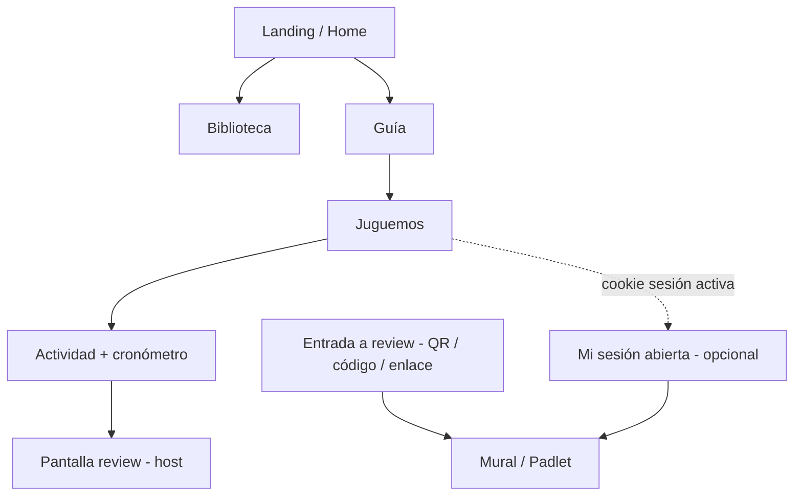
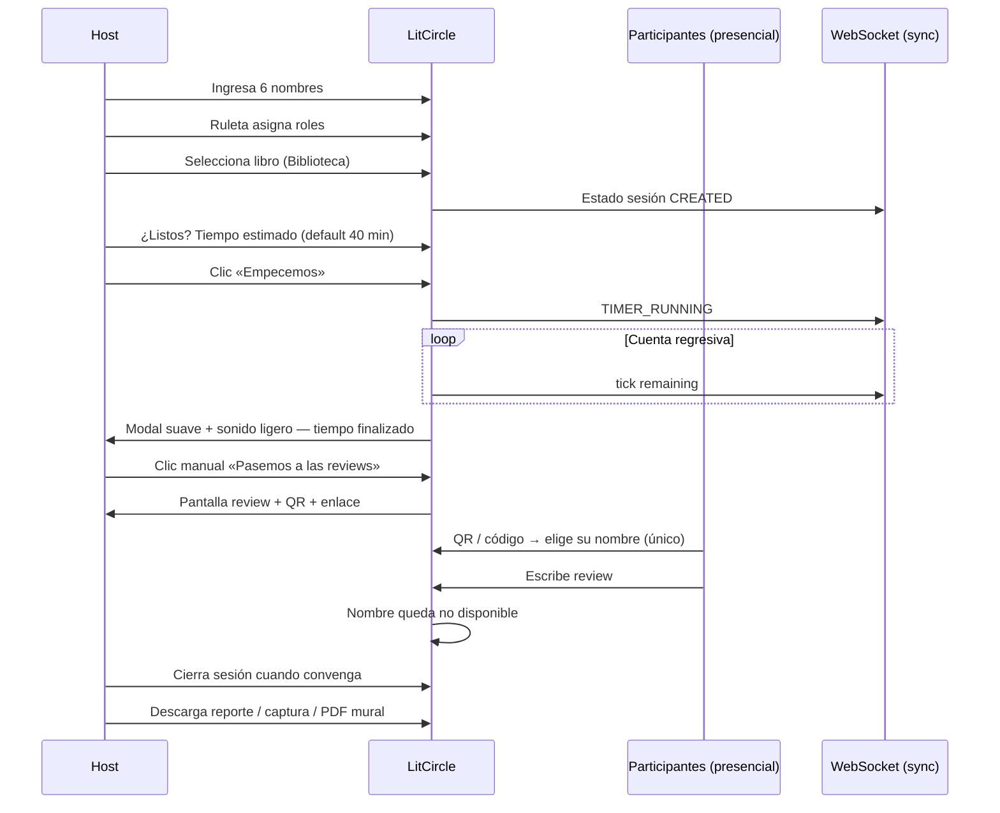
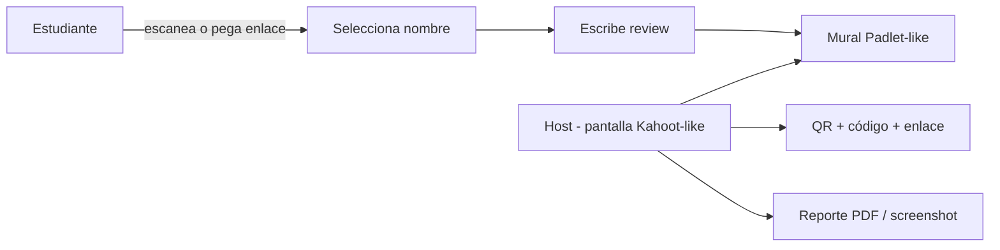

# LitCircle — Especificación de producto (SDD)

Documento de referencia para iteraciones futuras. **LitCircle** es el producto; **ChapterQuest** es el nombre técnico del repositorio y la plataforma serverless.

> Última revisión: reunión con cliente — junio 2026.

---

## 1. Resumen ejecutivo

LitCircle es una plataforma web para **círculos literarios escolares**: fortalecer hábitos de lectura, trabajo colaborativo e inglés mediante clubes de lectura interactivos con **role play** presencial, cronómetro facilitado y **reviews** asíncronas tipo mural (Padlet/Kahoot).

El flujo principal no es “subir PDFs como usuario”, sino **curaduría centralizada**: el equipo sube libros al bucket S3 y la biblioteca los lista automáticamente. La actividad en aula es **presencial**; el sistema apoya al docente/facilitador con temporizador, asignación de roles y recolección de reviews identificadas por participante.

---

## 2. Propuesta de valor

| Pilar | Descripción |
|-------|-------------|
| **Read** | Acceso a biblioteca curada de PDFs con preview |
| **Share** | Role play colaborativo con 6 roles definidos |
| **Learn Together** | Reviews post-actividad vinculadas a participantes reales de la sesión |

**Tagline:** *Read, Share, Learn Together*

**Contexto de uso:** escuelas, actividad presencial en aula, reviews posiblemente asíncronas (tarea).

---

## 3. Personas

| Persona | Rol en el sistema | Necesidades |
|---------|-------------------|-------------|
| **Host / docente** | Inicia sesión, asigna roles, controla timer, cierra sesión, exporta reporte | Flujo claro, no invasivo, panel de control |
| **Participante (estudiante)** | Uno de 6 nombres en la sesión; hace review escaneando QR o con código | Entrar sin fricción, elegir su nombre una sola vez |
| **Curador / admin** | Sube PDFs al bucket con metadata | Sin CRUD en app; operación vía S3/CLI |

---

## 4. Mapa del sitio

### 4.1 Landing (Home)

**Estado:** placeholder en código; contenido definido parcialmente por cliente.

**Contenido acordado:**

- Palabras de bienvenida: *Welcome to LitCircles, a platform designed to strengthen reading habits, collaborative work, and English skills through interactive book clubs.*
- Sección *What is the literary circle?* con definición del círculo literario.
- Imagen animada de **Malu y Danna** (animación por definir).
- **Futuro probable:** modelo 3D (Three.js) en hero de landing.

**Copy de referencia (inglés, UI puede ser bilingüe):**

> *Literary Circles are collaborative reading groups where students discuss a text, share ideas, and learn together through assigned roles.*

### 4.2 Biblioteca

**Modelo curado — sin upload público.**

| Aspecto | Decisión |
|---------|----------|
| Origen de libros | Directorio en bucket S3 (`{env}-chapterquest-uploads`, prefijo acordado ej. `library/`) |
| Quién sube | Curador/admin (CLI, consola AWS, script interno) — **no** el usuario final |
| Metadatos | Preferencia: **metadata nativa de objeto S3** (`x-amz-meta-*`) para autor, título, etc. |
| CRUD en app | **No** — evitar mantener servicio duplicado si metadata basta |
| UI | Listado + preview del PDF |

**Metadata S3 (propuesta técnica):**

| Clave metadata | Ejemplo | Uso en UI |
|----------------|---------|-----------|
| `x-amz-meta-title` | *Charlotte's Web* | Título |
| `x-amz-meta-author` | *E.B. White* | Autor |
| `x-amz-meta-language` | `en` | Badge idioma |
| `x-amz-meta-grade` | `5-6` | Nivel (opcional) |
| `x-amz-meta-cover` | URL o clave S3 | Portada (opcional) |

**Limitación:** metadata de usuario S3 ≈ 2 KB total por objeto — suficiente para campos de catálogo, no para sinopsis larga. Si hiciera falta texto largo, evaluar sidecar `.json` junto al PDF (decisión diferida).

**API prevista:** `GET /library` → Lambda lista prefijo + `HeadObject` por archivo → JSON para frontend. Preview vía **presigned GET** + visor en cliente (evaluar PDF.js / react-pdf).

### 4.3 Guía

Página estática (con componentes interactivos embebidos) que explica:

1. Cómo funciona el juego de role play.
2. Los **6 roles** (ver §5).
3. Flujo resumido: nombres → ruleta → libro → tiempo → actividad → review.
4. Cierre con CTA: **«¿Todo listo? Empecemos»** → navega a **Juguemos**.

### 4.4 Juguemos

Sección principal de la **dinámica de role play**. Redirige o contiene el flujo interactivo completo.

### 4.5 Mi sesión abierta (opcional, condicional)

Visible cuando el frontend detecta **sesión activa** (cookie/localStorage + validación backend).

- Lleva al panel tipo Padlet del host o del participante según rol.
- Nombre final por definir con cliente.

### 4.6 Entrada a review (participantes)

Múltiples caminos — todos deben convivir sin confundir a quien no tiene review pendiente:

| Método | Comportamiento |
|--------|----------------|
| **QR** (pantalla host) | Escaneo → selección de nombre → formulario review |
| **Enlace copiable** | Estilo Kahoot — URL con código de sesión/review |
| **Botón global** | «Tengo que hacer un review» → ingreso de código → tablero |

El botón global debe ser **discreto** o contextual para no parecer obsoleto cuando no hay reviews activas.

---

## 5. Los seis roles

Cada rol tiene descripción pedagógica (inglés en material cliente; UI puede mostrar ES/EN).

| Rol | Nombre EN | Responsabilidad resumida |
|-----|-----------|---------------------------|
| Facilitador | **Facilitator** | Abre discusión, resumen, pasaje interesante, preguntas, mantiene foco |
| Director de discusión | **Discussion Director** | Prepara preguntas que inviten a hablar del texto |
| Investigador | **Investigator** | Información extra: autor, contexto, setting, hechos |
| Conector | **Connector** | Conexiones text-to-self, text-to-world, text-to-text |
| Ilustrador | **Illustrator** | Dibujo/visual de evento, personaje o idea central |
| Inspector de vocabulario | **Vocabulary Inspector** | Palabras clave, significados, expresiones descriptivas |

**Asignación:** ruleta del sistema asigna **aleatoriamente** cada nombre (ingresado previamente en 6 cajas de texto) a un rol único.

---

## 6. Flujo de sesión (role play)

### 6.1 Reglas de negocio

| # | Regla |
|---|-------|
| R1 | Exactamente **6 participantes** por sesión (nombres libres, no requiere cuenta) |
| R2 | Cada nombre → **un rol** vía ruleta (sin repetición) |
| R3 | Un **libro** por sesión, elegido de biblioteca curada |
| R4 | Tiempo en **minutos**; default **40**; explicación clara al host |
| R5 | Cronómetro **cuenta atrás**; al llegar a 0: alerta **no invasiva** (modal + sonido suave) |
| R6 | Transición a review **manual** — botón «Realicemos el review» |
| R7 | En review, cada participante elige **su nombre de la sesión** una sola vez |
| R8 | Reviews **asíncronas** permitidas — identidad atada a sesión |
| R9 | Host **cierra sesión** explícitamente para liberar recursos e iniciar otra |
| R10 | Host puede **exportar** reporte (PDF o imagen del mural) |

### 6.2 Identificación de participantes

No se exige registro completo. Para reviews:

- Los 6 nombres se definen al inicio de la sesión.
- Al entrar al tablero, el participante **se autoselecciona** entre esos 6.
- Tras elegir, el nombre queda **bloqueado** para otros (optimistic lock / DynamoDB conditional write).

**Objetivo:** saber quién escribió qué en cada sesión real, aunque la review sea tarea para casa.

---

## 7. Flujo de review (mural)

**UI host:** código grande, QR, botón copiar enlace.

**UI participante:** selector de nombre → textarea/tarjeta → envío al mural.

**Sincronización:** cuando un participante publica, el mural del host se actualiza (WebSocket o polling; ver §9).

---

## 8. Requisitos no funcionales

| ID | Requisito | Notas |
|----|-----------|-------|
| NFR-1 | **WebSockets** para experiencia síncrona | Timer, ruleta, mural visible en tiempo real para quienes estén conectados |
| NFR-2 | **Detección de sesión activa** en frontend | Cookie/storage + API → muestra «Mi sesión abierta» |
| NFR-3 | Alertas **no invasivas** | Timer fin: modal + sonido opcional; no interrumpir abruptamente |
| NFR-4 | Serverless first | API Gateway HTTP + WebSocket API; Lambda; DynamoDB; S3 |
| NFR-5 | Escuelas / tablets | UI responsive; QR legible en proyector |
| NFR-6 | Entornos **dev/prod** | Chip «Test environment» en dev (implementado) |

### 8.1 WebSockets — dirección técnica (borrador)

Eventos previstos: `session.updated`, `timer.tick`, `role.assigned`, `review.posted`, `participant.claimed`.

---

## 9. Modelo de datos (evolución)

### 9.1 Implementado hoy

| Entidad | Almacén | Uso actual |
|---------|---------|------------|
| Guest profile | DynamoDB `Users` | Nombre invitado único (cookie + API) |

### 9.2 Planificado

| Entidad | Almacén | Propósito |
|---------|---------|-----------|
| **Book (catálogo)** | S3 + metadata | Fuente de verdad; DynamoDB opcional solo si metadata S3 no alcanza |
| **Session** | DynamoDB | Host, libro, 6 participantes, roles, estado, timer |
| **Review** | DynamoDB | Texto, sessionId, participantSlot, timestamp |
| **Connection** | DynamoDB | connectionId WebSocket ↔ sessionId |

**Tabla Sessions (propuesta):**

| Atributo | Descripción |
|----------|-------------|
| PK | `SESSION#<sessionId>` |
| SK | `METADATA` \| `PARTICIPANT#<1-6>` \| `REVIEW#<participantSlot>` |
| status | `draft` \| `running` \| `review` \| `closed` |
| bookKey | Clave S3 del PDF |
| timerMinutes | Entero |
| timerEndsAt | ISO timestamp |
| hostToken | Token para cerrar/exportar (sin auth completa) |

---

## 10. Estado de implementación

| Área | Estado | Notas |
|------|--------|-------|
| Infra AWS (dev/prod) | ✅ Desplegado | CloudFormation, CI/CD, OIDC |
| Guest / perfil básico | ✅ Parcial | POST `/users/guest`, cookie, banner |
| Landing contenido cliente | 🔲 Pendiente | Copy definido; animación TBD |
| Biblioteca S3 curada | 🔲 Pendiente | Reemplaza upload usuario |
| Guía (6 roles) | 🔲 Pendiente | Página + copy |
| Juguemos (ruleta, timer) | 🔲 Pendiente | Core pedagógico |
| WebSockets | 🔲 Pendiente | NFR sincronía |
| Review QR / mural | 🔲 Pendiente | Flujo Kahoot/Padlet |
| Export reporte | 🔲 Pendiente | PDF o imagen |
| Three.js landing | 🔲 Futuro | Probable iteración posterior |

**Rutas actuales en código (legacy):** `/`, `/library`, `/reviews`, `/community`, `/profile` — se reorganizarán según este documento en iteraciones de frontend.

---

## 11. Roadmap sugerido por iteraciones

| Iteración | Entregable | Dependencias |
|-----------|------------|--------------|
| **I1** ✅ | Fundación: monorepo, IaC, CI/CD, guest API | — |
| **I2** | Landing (copy cliente) + chip entorno + nav nueva | I1 |
| **I3** | Biblioteca: list S3 + metadata + preview PDF | Bucket `library/` + convención metadata |
| **I4** | Guía estática + CTA «Empecemos» | I3 (enlace a libros) |
| **I5** | Juguemos: nombres, ruleta, libro, timer local | I3 |
| **I6** | API Sessions + persistencia DynamoDB | I5 |
| **I7** | WebSocket sync (timer + mural) | I6, NFR-1 |
| **I8** | Review: QR, código, claim nombre, mural | I6 |
| **I9** | Host: cerrar sesión, export PDF/screenshot | I8 |
| **I10** | Landing Three.js / animación Malu y Danna | Diseño cliente |

---

## 12. Decisiones abiertas

| # | Tema | Opciones | Recomendación inicial |
|---|------|----------|------------------------|
| D1 | Visor PDF | PDF.js, react-pdf, iframe presigned | PDF.js — control y offline-friendly |
| D2 | Metadata vs JSON sidecar | Solo S3 metadata vs `{book}.pdf` + `{book}.json` | Metadata si ≤6 campos; JSON si hay sinopsis larga |
| D3 | Prefijo S3 biblioteca | `library/`, `books/en/` | `library/` plano al inicio |
| D4 | Nombre sección cookie | «Mi sesión abierta», «Continuar actividad» | Validar con cliente |
| D5 | Idioma UI | EN pedagógico / ES navegación | Bilingüe progresivo |
| D6 | Sonido timer | Web Audio API, archivo MP3 suave | MP3 corto, volumen bajo, respetar `prefers-reduced-motion` |
| D7 | Auth docente | Solo host token vs login futuro | Host token en URL/cookie para MVP escolar |

---

## 13. Glosario

| Término | Definición |
|---------|------------|
| **Círculo literario** | Grupo colaborativo que discute un texto con roles asignados |
| **Host** | Docente o facilitador que inicia y cierra la sesión |
| **Sesión** | Instancia única de actividad (6 participantes, 1 libro, 1 timer) |
| **Review** | Reflexión escrita post-actividad en el mural |
| **Curador** | Persona que sube PDFs al bucket (fuera de la app) |

---

## 14. Referencias

- [Architecture.md](./Architecture.md) — diagramas técnicos y AWS
- [Deployment.md](./Deployment.md) — deploy y entornos
- [Startup.md](./Startup.md) — bootstrap desde cero
- [README.md](../README.md) — entrada al repositorio
