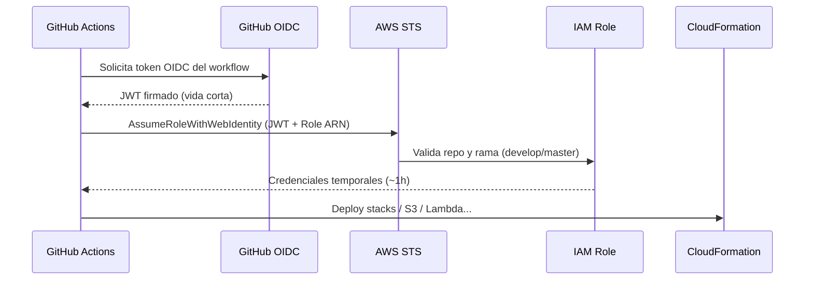

# Startup — LitCircle (ChapterQuest)

Guía de arranque: desde cero hasta el primer deploy automático con GitHub Actions **sin guardar access keys en GitHub**.

---

## ¿Qué hace el comando bootstrap?

Este comando se ejecuta **una vez** desde tu máquina (con AWS CLI autenticado):

```bash
aws cloudformation deploy \
  --template-file infrastructure/cloudformation/bootstrap/template.yaml \
  --stack-name chapterquest-bootstrap \
  --parameter-overrides \
    GitHubOrg=JosthinAyonC \
    GitHubRepo=chapterquest-serverless-app \
    ArtifactsBucketName=chapterquest-artifacts-TU_ACCOUNT_ID \
  --capabilities CAPABILITY_NAMED_IAM \
  --region us-east-1 \
  --profile litcircle
```

Crea el stack `chapterquest-bootstrap` con **tres recursos clave**:

| Recurso | Para qué sirve |
|---------|----------------|
| **GitHub OIDC Provider** | Confía en tokens emitidos por GitHub Actions |
| **IAM Role** (`chapterquest-github-deploy-…`) | Rol que GitHub puede asumir temporalmente |
| **S3 Artifacts Bucket** | Guarda templates CloudFormation y bundles de Lambda |

### ¿Necesitas poner credenciales AWS en GitHub?

**No.** Ese es el punto del bootstrap.

GitHub Actions **no** usa `AWS_ACCESS_KEY_ID` / `AWS_SECRET_ACCESS_KEY` en Secrets. En su lugar:



En el workflow esto ocurre en el step:

```yaml
- uses: aws-actions/configure-aws-credentials@v4
  with:
    role-to-assume: ${{ vars.AWS_DEPLOY_ROLE_ARN }}
    aws-region: us-east-1
```

GitHub presenta su token → AWS verifica que el request viene de **tu repo** y **tu rama** (`develop` o `master`) → entrega credenciales temporales.

### ¿Es obligatorio?

**Sí, una vez**, antes de que CI pueda desplegar solo.

Es el problema del huevo y la gallina:

- GitHub Actions necesita un rol IAM para desplegar.
- Ese rol no puede crearse a sí mismo desde Actions (aún no tiene permisos).
- Por eso el **bootstrap es manual** desde tu CLI con credenciales de admin.

Después del bootstrap, **todo deploy de infra/app va por Actions** (push a `develop` o `master`).

---

## Dos stacks, dos propósitos

No confundir:

| Stack | Cuándo | Quién lo despliega |
|-------|--------|---------------------|
| `chapterquest-bootstrap` | Una sola vez | Tú, manualmente (CLI) |
| `chapterquest-root-dev` | Cada cambio de infra/app en dev | GitHub Actions (push `develop`) |
| `chapterquest-root-prod` | Cada cambio en prod | GitHub Actions (push `master`) |

---

## Checklist de startup

### A. Local (tu máquina)

- [ ] Node 24 + pnpm 10 (`nvm use`, `corepack enable`)
- [ ] Perfil AWS separado para LitCircle (no mezclar con SSO de otros clientes):

  ```bash
  # ~/.aws/credentials → [litcircle]
  # ~/.aws/config      → [profile litcircle] region=us-east-1

  export AWS_PROFILE=litcircle
  aws sts get-caller-identity   # debe mostrar TU cuenta
  ```

- [ ] `pnpm install && pnpm build && pnpm test`

### B. Bootstrap AWS (una vez)

- [ ] Ejecutar comando bootstrap (arriba) con tu `Account ID`
- [ ] Verificar outputs:

  ```bash
  aws cloudformation describe-stacks \
    --stack-name chapterquest-bootstrap \
    --query 'Stacks[0].Outputs' \
    --output table \
    --profile litcircle \
    --region us-east-1
  ```

- [ ] Anotar `ArtifactsBucketName` y `GitHubDeployRoleArn`

> Si cambias las ramas permitidas en el template bootstrap, **redeploy** el stack bootstrap para actualizar la trust policy del rol.

### C. GitHub (repo settings)

- [ ] **Environments:** crear `dev` y `prod`
- [ ] **Variables** — repository variables bastan; opcionalmente duplicar en cada environment (`dev`/`prod`) las mismas cuatro:

  | Variable | Ejemplo |
  |----------|---------|
  | `AWS_DEPLOY_ROLE_ARN` | `arn:aws:iam::493297568876:role/chapterquest-github-deploy-493297568876` |
  | `AWS_REGION` | `us-east-1` |
  | `ARTIFACTS_BUCKET` | `chapterquest-artifacts-493297568876` |
  | `VITE_API_BASE_URL` | URL API real (actualizar tras primer deploy) |

  > Si el workflow usa `environment: dev`, el rol IAM debe permitir `repo:…:environment:dev` en el bootstrap (ya incluido en el template).

- [ ] **No** agregar access keys de IAM en Secrets

### D. Primer deploy

- [ ] Push a rama `develop`:

  ```bash
  git push -u origin develop
  ```

- [ ] Revisar Actions → `Infrastructure CI/CD`, `Backend CI/CD`, `Frontend CI/CD`
- [ ] Tras éxito, actualizar `VITE_API_BASE_URL` y `FrontendOrigin` en `infrastructure/environments/dev/params.env`

### E. Verificación

```bash
# API en la nube
curl https://TU-API.execute-api.us-east-1.amazonaws.com/dev/health

# Debe responder:
# {"service":"chapterquest-api","status":"healthy"}
```

Abrir `FrontendUrl` del stack `chapterquest-root-dev` en el navegador.

---

## Mapeo ramas → entornos

| Rama GitHub | Environment GitHub | Entorno AWS | Stack |
|-------------|-------------------|-------------|-------|
| `develop` | `dev` | dev | `chapterquest-root-dev` |
| `master` | `prod` | prod | `chapterquest-root-prod` |

---

## Preguntas frecuentes

### ¿Puedo saltarme el bootstrap y desplegar solo con mi CLI?

Sí, manualmente con `./scripts/deploy-stack.sh dev`. Pero CI seguirá sin funcionar hasta que exista el rol OIDC.

### ¿Por qué un bucket de artefactos?

CloudFormation nested stacks y Lambdas necesitan templates y `.zip`/`.js` en S3. Actions sube ahí antes de desplegar.

### ¿El rol OIDC es seguro?

Más que access keys estáticas:

- Credenciales **temporales** (minutos/hora)
El rol solo acepta tokens cuyo claim `sub` coincida con el repo y la rama **o** el environment de GitHub:

- `repo:…:ref:refs/heads/develop` / `master`
- `repo:…:environment:dev` / `prod` ← necesario cuando el workflow usa `environment: dev`
- Sin secrets de larga vida en GitHub

### ¿Qué pasa si cambio el nombre del repo?

Redeploy bootstrap con el nuevo `GitHubRepo` en los parámetros.

---

## Siguiente lectura

- [Deployment.md](Deployment.md) — detalle de deploy manual, dominio custom, troubleshooting
- [Architecture.md](Architecture.md) — diseño técnico y diagramas
- [functions/README.md](../functions/README.md) — cómo agregar una Lambda

---

**Resumen:** el bootstrap conecta GitHub Actions con AWS vía OIDC. Sin él, no hay deploy automático sin credenciales. Con él, solo configuras el ARN del rol en variables de GitHub y listo.
